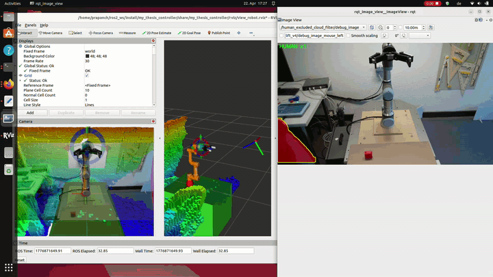

<h1 align="center">Human-Robot Interaction with Force Feedback on a UR3e Cobot</h1>

<p align="center">
  <b>Master's thesis · THD Deggendorf · 2025–2026</b><br>
  <i>ROS 2 Humble · MoveIt 2 · YOLOv8 · RealSense D435i · ISO/TS 15066</i>
</p>

<p align="center">
  
  
  
  
  
  
</p>

<p align="center">
  
</p>

> A complete real-time **Human-Robot Interaction framework** for safe assistive manipulation on a Universal Robots UR3e cobot. The robot autonomously perceives and grasps an object, then lets a human guide it to the placement location through admittance-based hand-leading. A double-tap gesture on the end-effector signals placement completion. YOLOv8 segmentation filters human presence from collision detection, enabling safe shared-workspace operation under ISO/TS 15066 SSM, PFL, and hand-guiding modes.

---

## Highlights

- **Hybrid position + admittance control** with adaptive damping and intent amplification.
- **Multimodal perception**: Intel RealSense D435i with intrinsic and hand-eye calibration, YOLOv8-seg human exclusion, HSV object detection, and depth back-projection into the robot base frame.
- **ISO/TS 15066 safety layer**: SSM (Speed and Separation Monitoring), PFL (Power and Force Limiting), hand-guiding.
- **13-state task FSM** integrating autonomous grasp planning with human-guided placement.
- **Three launch paths**: real hardware, hardware + full human-exclusion pipeline, Gazebo Ignition simulation with walking actor.
- **Reproducible**: dependency manifests, rosdep-managed external packages, Apache-2.0 licensed.

---

## System architecture

```
                         +-----------------------+
                         |   Intel RealSense     |
                         |        D435i          |
                         +-----------+-----------+
                                     |
                                     v
+----------------+    +------------------------------+
| YOLOv8-seg     |--->| human_excluded_cloud_filter  |---> OctoMap
+----------------+    +------------------------------+
                                     |
                                     v
              +----------------------+----------------------+
              |                                             |
+----------------------+                       +-------------------------+
|   ft_zeroer (F/T)    |---------------------> |   hybrid_control_node    |
+----------------------+                       +------------+------------+
                                                            |
                                                            v
                                              +-------------------------+
                                              |       MoveIt Servo      |
                                              +------------+------------+
                                                            |
                                                            v
                                              +-------------------------+
                                              |     UR3e ROS 2 driver   |
                                              +-------------------------+

         human_interaction_classifier  --->  IDLE / GUIDING / NUDGE FSM
         assistive_lift_v4_node        --->  13-state task FSM
         robotiq_urscript_bridge       --->  TCP socket to URCap (gripper)
```

---

## Task FSM

`INIT` → `PERCEIVE` → `PLAN_GRASP` → `MOVE_TO_PREGRASP` → `GRASP` → `LIFT` →
`AWAIT_INTERACTION` *(human guides via admittance)* → *(double-tap)* →
`PREP_PLACE` → `DESCEND` → `PLACE` → `RETREAT` → `DONE`

---

## Repository layout

```
src/
├── my_thesis_controller/              [Custom thesis nodes]
│   ├── hybrid_control_node.py          Hybrid position + admittance controller
│   ├── human_interaction_classifier.py IDLE / GUIDING / NUDGE FSM
│   ├── assistive_lift_v4_node.py       Top-level 13-state task controller
│   ├── human_excluded_cloud_filter.py  YOLOv8-seg person masking on cloud
│   ├── octomap_gate.py                 Cloud gating during human guidance
│   ├── robotiq_urscript_bridge.py      Gripper TCP control via URCap
│   ├── ft_zeroer.py                    Force/torque bias removal
│   └── safety_monitor.py               ISO/TS 15066 SSM + PFL supervisor
├── ur3e_moveit_config/                MoveIt 2 configs and launch files
├── ur_description_gz/                 Customised UR3e URDF and meshes
└── robotiq_description/               Robotiq 2F-140/-85 URDF and meshes

scripts/
├── calibrate_doubletap.py             5-round tap threshold calibration
└── test_doubletap.py                  Tap verification tool

cpp/
└── ft_zeroer_cpp/                     C++ port of ft_zeroer node (rclcpp)
```

---

## Quickstart

### Prerequisites

- Ubuntu 22.04 + ROS 2 Humble
- UR3e with F/T sensor (URCap configured) and Robotiq 2F-140 gripper
- Intel RealSense D435i

```bash
sudo apt install ros-humble-moveit ros-humble-moveit-servo \
  ros-humble-ros2-control ros-humble-realsense2-camera
pip3 install "numpy<2" "opencv-python<4.11" scipy ultralytics
```

### Build

```bash
git clone https://github.com/NishanthSundaran/Human-Robot-Interaction-with-Force-Feedback-in-Collaborative-Tasks.git ~/thesis_ws/src/thesis
cd ~/thesis_ws
vcs import src < src/thesis/dependencies.repos
rosdep install --from-paths src --ignore-src -r -y
colcon build --symlink-install
```

### Run

```bash
# Simulation (Gazebo Ignition, no hardware required)
ros2 launch ur3e_moveit_config assistive_lift_v4_sim.launch.py

# Real hardware
ros2 launch ur3e_moveit_config assistive_lift_v4_hardware_hri.launch.py
```

---

## Critical implementation notes

| Lesson | Workaround |
|---|---|
| ROS 2 Humble `cv_bridge` segfaults under NumPy 2.x and `opencv-python>=4.11` | Pin `numpy<2` and `opencv-python<4.11` |
| `ompl_planning.yaml` and `sensors_3d.yaml` are MoveIt-native YAML | Load with `yaml.safe_load()` and pass as dicts |
| MoveIt 2 Humble planning pipelines need nested config under pipeline name | Use `planning_pipelines: ["ompl"]` + `ompl.planning_plugin: ...` |
| UR driver loads `forward_velocity_controller` inactive | Activate explicitly in hardware launch |

---

## Credits

- **Author**: Nishanth Sundaran ([GitHub](https://github.com/NishanthSundaran))
- **Supervisor**: [add when committing publicly]
- **Hardware**: THD Cham robotics lab

---

## License

Apache 2.0. See [LICENSE](LICENSE).

If you use this work for research, please cite:

```bibtex
@mastersthesis{sundaran2026hri,
  author       = {Nishanth Sundaran},
  title        = {Human-Robot Interaction with Force Feedback in Collaborative Tasks},
  school       = {Deggendorf Institute of Technology (THD)},
  year         = {2026}
}
```
